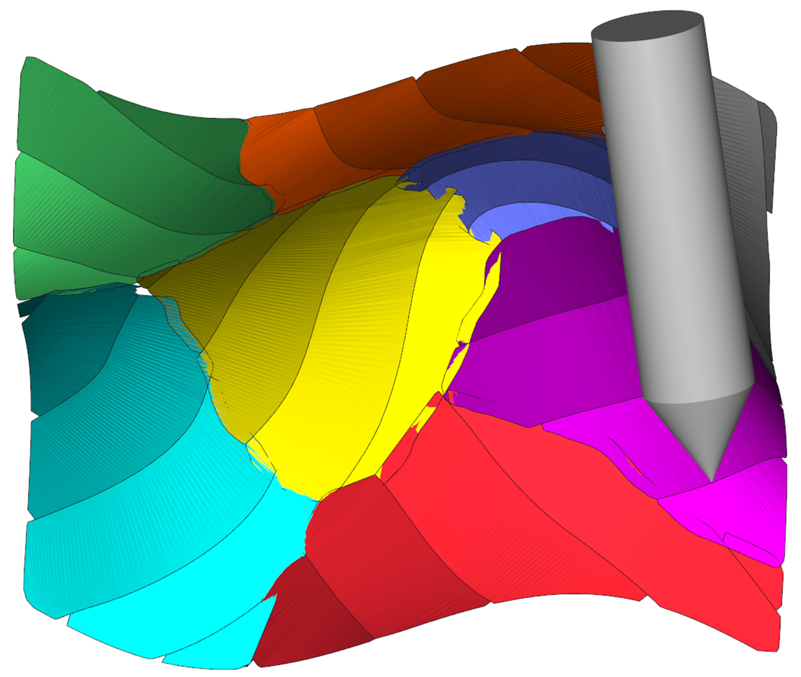

I received my PhD in department of Mechanical Engineering at Hong Kong University of Science and Technology (HKUST). Now I am a postdoctoral fellow at HKUST. I conduct research in <a href="http://mektang.people.ust.hk/">Prof. Kai TANG</a>'s Lab, where my research interests include computer-aided design/manufacturing and (geometric) signal processing in manufacturing process.

Please take a look through my site and feel free to contact me if you have any questions or would be interested in working together!

<!--
<a href="https://outlook.office365.com/owa/calendar/5bba860448ee4699951c23d0497e68c7@connect.ust.hk/875dd7cc2f224ef6ba1217a7c56db54813388903898056239305/calendar.html">Calendar</a>
-->
<a href="mailto:dong.he@connect.ust.hk">Email</a> |
<a href="https://scholar.google.com/citations?user=hHxsez8AAAAJ&hl=zh-CN&oi=sra">Google Scholar</a> |
<a href="https://www.researchgate.net/profile/Dong_He8">Research Gate</a> |
<a href="https://www.linkedin.com/in/hedong">LinkedIn</a> |
<a href="https://github.com/dong-he">GitHub</a>

### Education
* Ph.D Hong Kong University of Science and Technology, 2019-2022
* M.S. Xi’an Jiaotong University, 2015-2018
* B.S. Xi’an Jiaotong University, 2011-2015

### Teaching
* **Teaching Assistant**, MECH 4740 Numerical methods, HKUST, 02/2021-06/2021  
* **Teaching Assistant**, MESF 5380 Advanced numerical methods, HKUST, 02/2021-06/2021  
* **Teaching Assistant**, Final year project of undergraduates, XJTU, 12/2016-10/2017

### Publications
The latest publications are on <a href="https://scholar.google.com/citations?user=hHxsez8AAAAJ&hl=zh-CN&oi=sra">Google Scholar Profile</a>.

___
* **Vector field-based curved layer slicing and path planning for multi-axis printing** 
Yamin Li, **Dong He**, Shangqin Yuan, Kai Tang, Jihong Zhu 
*Journal of Robotics and Computer-Integrated Manufacturing, 2022.* [[Paper]](https://doi.org/10.1016/j.rcim.2022.102362)

___
* **Kinematics-based five-axis trochoidal milling process planning for deep and curved 3D slots** 
Zhaoyu Li, **Dong He**, Ke Xu, Kai Tang 
*Journal of Manufacturing Science and Engineering, 2021.* [[Paper]](https://doi.org/10.1115/1.4051707)

___
* **Quasi-developable and signed multi-strip approximation of a surface mesh for efficient flank milling** 
**Dong He**, Zhaoyu Li, Yamin Li, Kai Tang 
*Computer-Aided Design, special issue of 2021 Solid and Physical Modeling Conference, Sept. 27-29, 2021.*(**Travel Award**) [[Paper]](https://doi.org/10.1016/j.cad.2021.103083)

      

___
* **Geodesic Distance Field-Based Process Planning for Five-Axis Machining of Complicated Parts** 
**Dong He**, Yamin Li, Zhaoyu Li, Kai Tang 
*Journal of Manufacturing Science and Engineering, 2021.* [[Paper]](https://github.com/Dong-He/Dong-He.github.io/blob/ed12be06663bdd48c433524e818c14045e3cc71f/files/Geodesic%20Distance%20Field-Based%20Process%20Planning%20for%20Five-Axis%20Machining%20of%20Complicated%20Parts.pdf)

    

___

* **Multi-Axis Support-Free Printing of Freeform Parts with Lattice Infill Structures** 
Yamin Li, Kai Tang, **Dong He**, Xiangyu Wang 
*Computer-Aided Design, 2021.* [[Paper]](files/Multi-AxisSupport-FreePrintingofFreeformPartswithLatticeInfillStructures.pdf)

    

___

* **Downsampling-based synchrosqueezing transform and its applications on large-scale vibration data** 
**Dong He**, Hongrui Cao 
*Journal of Sound and Vibration, 2020.* [[Paper]](https://doi.org/10.1016/j.jsv.2021.115938) [[Code]](https://github.com/Dong-He/downsampled_SST)

    

___

* **Time-reassigned synchrosqueezing transform: The algorithm and its applications in mechanical signal processing** 
**Dong He**, Hongrui Cao, Shibin Wang, Xuefeng Chen 
*Mechanical Systems and Signal Processing, 2019.* [[Paper]](https://doi.org/10.1016/j.ymssp.2018.08.004) [[Code]](https://github.com/Dong-He/tsst)

    

___

* **Vibration signal correction of unbalanced rotor due to angular speed fluctuation** 
Hongrui Cao, **Dong He**, Songtao Xi, Xuefeng Chen 
*Mechanical Systems and Signal Processing, 2018.* [[Paper]](https://doi.org/10.1016/j.ymssp.2018.01.030)

    

___

* **An improvement of time-reassigned synchrosqueezing transform algorithm and its application in mechanical fault diagnosis** 
Hongrui Cao, Xiangsheng Wang, **Dong He**, Xuefeng Chen 
*Measurement, 2020.* [[Paper]](https://doi.org/10.1016/j.measurement.2020.107538)

___

* **A novel underdetermined blind source separation method with noise and unknown source number** 
Jiantao Lu, Wei Cheng, **Dong He**, Yanyang Zi 
*Journal of Sound and Vibration, 2019.* [[Paper]](https://doi.org/10.1016/j.jsv.2019.05.037)

___

<body>
    

          
    

</body>
