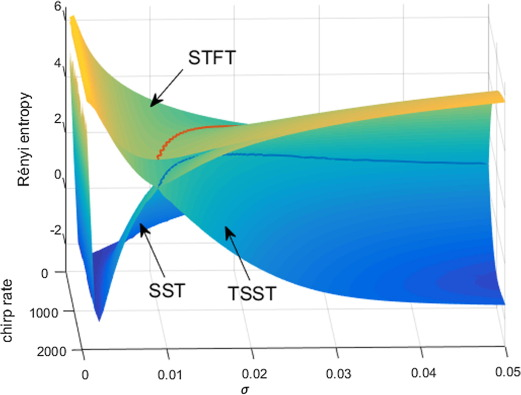

I am a Ph.D. Student in department of Mechanical Engineering at Hong Kong University of Science and Technology. <a href="https://docs.google.com/document/d/1I_pskUUkR0F-M39aNBe-BI2NoyAhiWc2to2PEfdwV4k/edit?usp=sharing">(CV)</a> I conduct research in <a href="http://mektang.people.ust.hk/">Prof. Kai TANG</a>'s Lab, where my research interests include computer-aided design/manufacturing/inspection and signal processing in manufacturing process.

Please take a look through my site and feel free to contact me if you have any questions or would be interested in working together!

<!--
<a href="https://outlook.office365.com/owa/calendar/5bba860448ee4699951c23d0497e68c7@connect.ust.hk/875dd7cc2f224ef6ba1217a7c56db54813388903898056239305/calendar.html">Calendar</a>
-->
<a href="mailto:dong.he@connect.ust.hk">Email</a> |
<a href="https://scholar.google.com/citations?user=hHxsez8AAAAJ&hl=zh-CN&oi=sra">Google Scholar</a> |
<a href="https://www.researchgate.net/profile/Dong_He8">Research Gate</a> |
<a href="https://www.linkedin.com/in/hedong">LinkedIn</a> |
<a href="https://github.com/dong-he">Github</a>

### Education
* Ph.D Hong Kong University of Science and Technology, 2019-present  
* M.S. Xi’an Jiaotong University, 2015-2018  
* B.S. Xi’an Jiaotong University, 2011-2015

### Experience
* **Research Assistant**, Shenzhen Institutes of Advanced Technology, Chinese Academy of Sciences, 07/2018-07/2019  
* **System Engineer Intern**, Envision Energy LLC, 07/2017-08/2017  
* **Volunteer**, The 120th Anniversary Celebration of XJTU, 04/2016

### Teaching
* **Teaching Assistant**, MECH 4740 Numerical methods, HKUST, 02/2021-06/2021  
* **Teaching Assistant**, MESF 5380 Advanced numerical methods, HKUST, 02/2021-06/2021  
* **Teaching Assistant**, Final year project of undergraduates, XJTU, 12/2016-10/2017

### Publications
The latest publications are on <a href="https://scholar.google.com/citations?user=hHxsez8AAAAJ&hl=zh-CN&oi=sra">Google Scholar Profile</a>.

* [Geodesic Distance Field-Based Process Planning for Five-Axis Machining of Complicated Parts](https://doi.org/10.1115/1.4048956). **Dong He**, Yamin Li, Zhaoyu Li, Kai Tang, Journal of Manufacturing Science and Engineering, 2021.

    

* [Multi-Axis Support-Free Printing of Freeform Parts with Lattice Infill Structures](https://doi.org/10.1016/j.cad.2020.102986). Yamin Li, Kai Tang, **Dong He**, Xiangyu Wang, Computer-Aided Design, 2021.

    

* [Downsampling-based synchrosqueezing transform and its applications on large-scale vibration data](https://doi.org/10.1016/j.jsv.2021.115938). **Dong He**, Hongrui Cao, Journal of Sound and Vibration, 2020.

    

* [Time-reassigned synchrosqueezing transform: The algorithm and its applications in mechanical signal processing](https://doi.org/10.1016/j.ymssp.2018.08.004). **Dong He**, Hongrui Cao, Shibin Wang, Xuefeng Chen, Mechanical Systems and Signal Processing, 2019.

    

* [Vibration signal correction of unbalanced rotor due to angular speed fluctuation](https://doi.org/10.1016/j.ymssp.2018.01.030). Hongrui Cao, **Dong He**, Songtao Xi, Xuefeng Chen, Mechanical Systems and Signal Processing, 2018.

    

* [An improvement of time-reassigned synchrosqueezing transform algorithm and its application in mechanical fault diagnosis](https://doi.org/10.1016/j.measurement.2020.107538). Hongrui Cao, Xiangsheng Wang, **Dong He**, Xuefeng Chen, Measurement, 2020.

* [A novel underdetermined blind source separation method with noise and unknown source number](https://doi.org/10.1016/j.jsv.2019.05.037). Jiantao Lu, Wei Cheng, **Dong He**, Yanyang Zi, Journal of Sound and Vibration, 2019.
 
